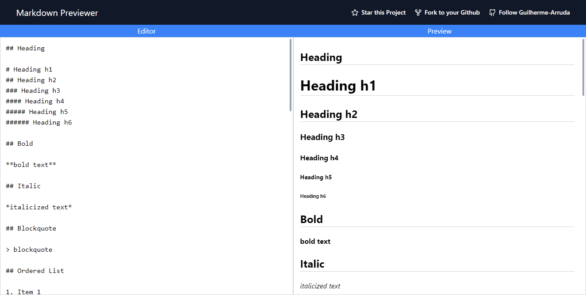

# Markdown Previewer

Online markdown editor with live preview.

## Web Version



## Technologies

- Vite
- Tailwind CSS
- React Markdown
- ESLint
- Prettier

## 🤖 Demo

You can view the project demo at [https://markdown-previewer-guilherme-arruda.vercel.app](https://markdown-previewer-guilherme-arruda.vercel.app).

## 🚀 Getting Started

To run the project in your machine you can clone this repository locally in a directory of your choice using:

```
git clone https://github.com/Guilherme-Arruda/Markdown-Previewer.git
```

After cloning you need to install all dependencies using:

```bash
npm install
# or
yarn
```

Then you can finally run the project using:

```bash
npm run dev
# or
yarn dev
```

## 📄 License

This project is under MIT license - see the file [LICENSE.md](https://github.com/Guilherme-Arruda/Markdown-Previewer/blob/master/LICENSE) for details.

---

##### Coded with love by Guilherme Arruda ♥️
